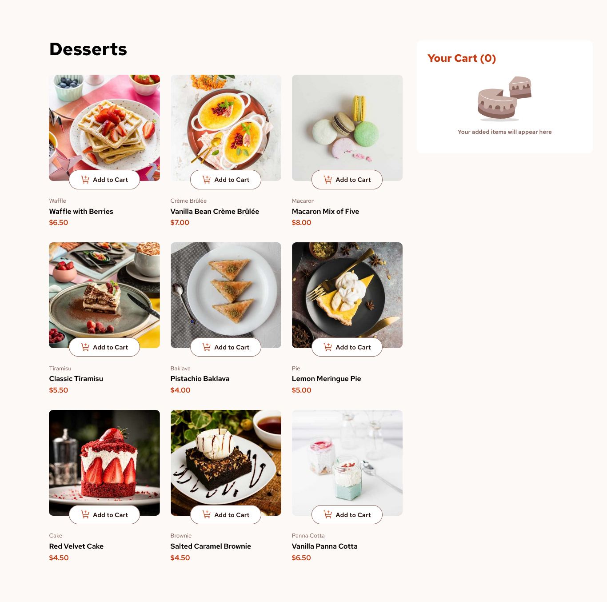

# Product list with cart solution

This is a solution to the [Product list with cart challenge on Frontend Mentor](https://www.frontendmentor.io/challenges/product-list-with-cart-5MmqLVAp_d). Frontend Mentor challenges help you improve your coding skills by building realistic projects. 

## Table of contents

- [Overview](#overview)
  - [The challenge](#the-challenge)
  - [Screenshot](#screenshot)
- [My process](#my-process)
  - [Built with](#built-with)
  - [What I learned](#what-i-learned)
  - [Useful resources](#useful-resources)
- [Author](#author)


## Overview
### The challenge

Users should be able to:

- Add items to the cart and remove them
- Increase/decrease the number of items in the cart
- See an order confirmation modal when they click "Confirm Order"
- Reset their selections when they click "Start New Order"
- View the optimal layout for the interface depending on their device's screen size
- See hover and focus states for all interactive elements on the page

### Final Design




### Links

- Solution URL: [Add solution URL here](https://your-solution-url.com)
- Live Site URL: [Add live site URL here](https://your-live-site-url.com)

### Built with

- Semantic HTML5 markup
- CSS custom properties
- Flexbox
- CSS Grid
- Mobile-first workflow
- Vanilla.js


### What I learned

In javascript most of my errors were ocurring due to scoping and declaring issues. The way i went about declaring the variables mostly was at the first point so there scopes were global and i could access them more easily. I would love to be corrected on the best practices.  
  
*Here is the code snippet of how i declared most of my variables*
```js
let btns;
let svgs;
let cartTotal = 0;
let orderTotal = 0;
let code = "";
let items = "";
let datas;
let attr;
let quantities = {};
let cartImg;
let btnPara;
let btnIncr;
let btnDecr;
let productImg;
```


### Continued development

Overall i enjoyed this project i would like to know what best resources are there for mastering javascript, me personally i think me doing projects is the best way i am learning so i am currently going to be doing other projects.


### Useful resources

- [Color Picker](https://redketchup.io/color-picker#google_vignette) - If you did not find the right color's in the style guide this site would come in handy.
- [Measuring Browser Extension](https://chromewebstore.google.com/detail/measure-it/jocbgkoackihphodedlefohapackjmna) - This is an amazing extension i recently found, if you did't get the figma files for the project the measurement's can get tricky so i recommend you this tool.

## Author

- LinkedIn - [Adnan Mohammed](www.linkedin.com/in/adnan-mohammed-765015304)
- Twitter - [@DevByAdnan](https://x.com/DevByAdnan)


